 

<h2>👾 About Me</h2>

<table>
  <tr>
    <td></td>
    <td></td>
  </tr>
  <tr>
    <td></td>
    <td></td>
  </tr>
  <tr>
    <td></td>
    <td></td>
  </tr>
</table>

 

**focus:**
- OSINT & digital forensics
- Network security & infrastructure hardening
- Security policy & compliance frameworks
- Tool development with Python & FastAPI

**currently_learning:**
- Claude API
- D3.js
- Advanced OSINT tradecraft

**hobbies:**
- building tools nobody asked for
- CTF
- tinkering

---

## 🚀 Featured Project

### [CrawlR — OSINT Investigation Platform](https://github.com/Err0ric/crawlr)
> Browser-based OSINT platform. No install. No setup. One Claude API key unlocks everything.

- Username enumeration across 3,000+ platforms via Sherlock + Maigret
- Email breach detection, DNS/WHOIS/SSL recon, port scanning
- Email header analysis with spoofing and phishing detection
- AI-powered Deep Dive intelligence dossier via Claude API
- Live at **[crawlr.lol](https://crawlr.lol)**

---

## 🐍 Contribution Snake

<picture>
  <source media="(prefers-color-scheme: dark)" srcset="https://raw.githubusercontent.com/Err0ric/Err0ric/output/github-contribution-grid-snake-dark.svg">
  <source media="(prefers-color-scheme: light)" srcset="https://raw.githubusercontent.com/Err0ric/Err0ric/output/github-contribution-grid-snake.svg">
  
</picture>

---

